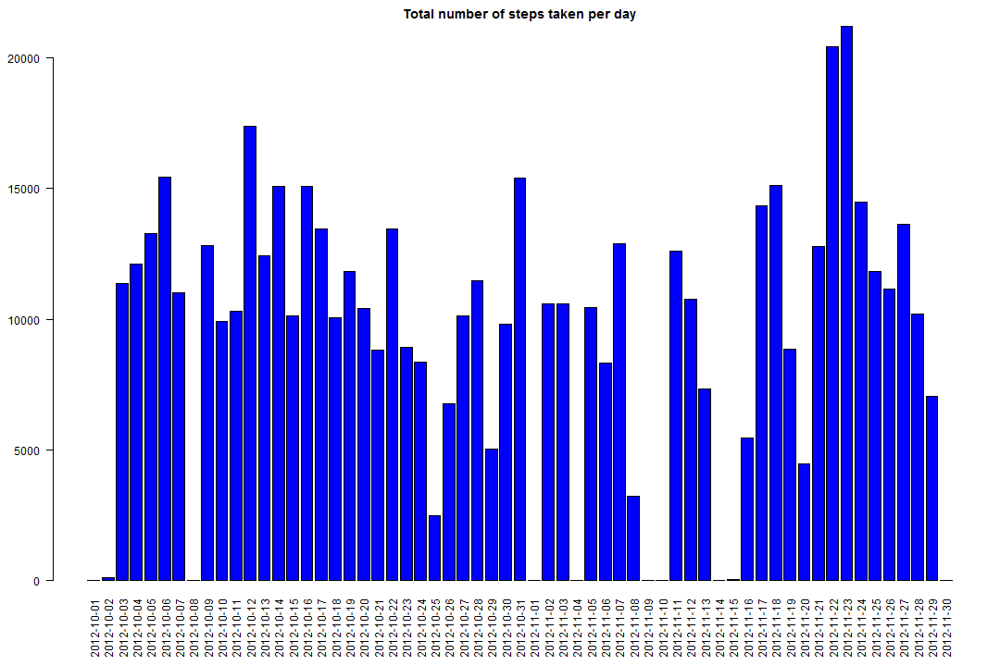
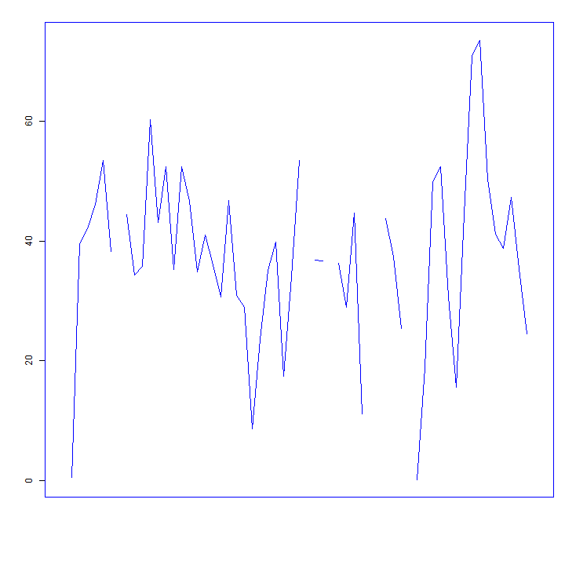
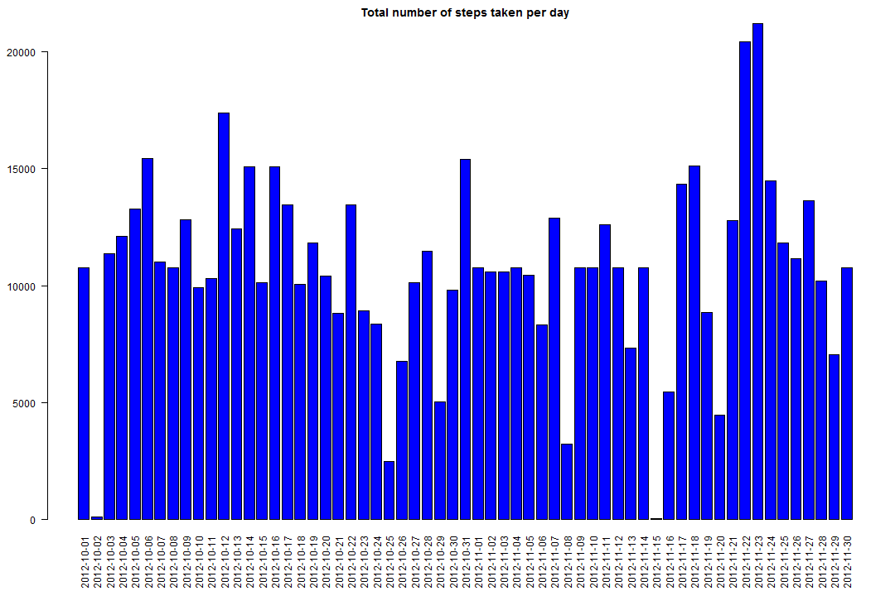
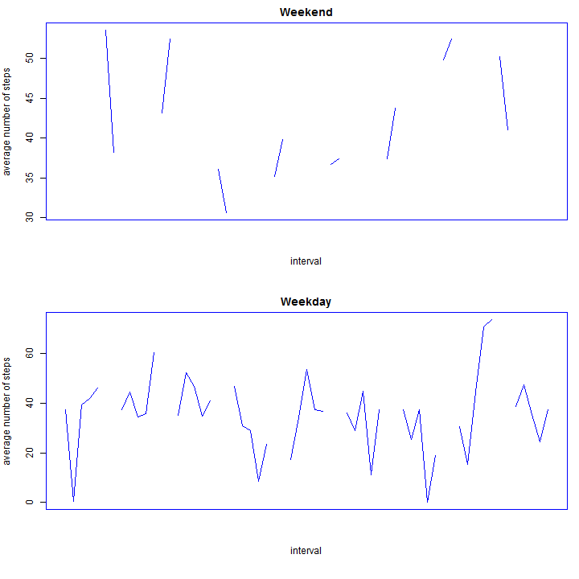

Reproducible Research: Peer Assessment 1
==============================================


```r
## Loading and preprocessing the data
activity <- read.csv(".\\activity.csv")
```

## What is mean total number of steps taken per day?

```r
stepsum <- tapply(activity$steps,activity$date,sum, na.rm=TRUE)

par(mar = c(6, 4, 2, 1))
barplot(stepsum, main="Total number of steps taken per day", las=2, col="blue")
```

 

### The mean of total number of steps taken per day

```r
stepavg <- tapply(activity$steps,activity$date,mean, na.rm=TRUE)
df <- data.frame(Date=names(stepavg),Avg=stepavg)
print(df,row.names=FALSE)
```

```
##        Date     Avg
##  2012-10-01     NaN
##  2012-10-02  0.4375
##  2012-10-03 39.4167
##  2012-10-04 42.0694
##  2012-10-05 46.1597
##  2012-10-06 53.5417
##  2012-10-07 38.2465
##  2012-10-08     NaN
##  2012-10-09 44.4826
##  2012-10-10 34.3750
##  2012-10-11 35.7778
##  2012-10-12 60.3542
##  2012-10-13 43.1458
##  2012-10-14 52.4236
##  2012-10-15 35.2049
##  2012-10-16 52.3750
##  2012-10-17 46.7083
##  2012-10-18 34.9167
##  2012-10-19 41.0729
##  2012-10-20 36.0938
##  2012-10-21 30.6285
##  2012-10-22 46.7361
##  2012-10-23 30.9653
##  2012-10-24 29.0104
##  2012-10-25  8.6528
##  2012-10-26 23.5347
##  2012-10-27 35.1354
##  2012-10-28 39.7847
##  2012-10-29 17.4236
##  2012-10-30 34.0938
##  2012-10-31 53.5208
##  2012-11-01     NaN
##  2012-11-02 36.8056
##  2012-11-03 36.7049
##  2012-11-04     NaN
##  2012-11-05 36.2465
##  2012-11-06 28.9375
##  2012-11-07 44.7326
##  2012-11-08 11.1771
##  2012-11-09     NaN
##  2012-11-10     NaN
##  2012-11-11 43.7778
##  2012-11-12 37.3785
##  2012-11-13 25.4722
##  2012-11-14     NaN
##  2012-11-15  0.1424
##  2012-11-16 18.8924
##  2012-11-17 49.7882
##  2012-11-18 52.4653
##  2012-11-19 30.6979
##  2012-11-20 15.5278
##  2012-11-21 44.3993
##  2012-11-22 70.9271
##  2012-11-23 73.5903
##  2012-11-24 50.2708
##  2012-11-25 41.0903
##  2012-11-26 38.7569
##  2012-11-27 47.3819
##  2012-11-28 35.3576
##  2012-11-29 24.4688
##  2012-11-30     NaN
```

### The median of total number of steps taken per day

```r
stepmedian <- tapply(activity$steps,activity$date,median,na.rm = FALSE)
dfmedian <- data.frame(Date=names(stepmedian),Median=stepmedian)
print(dfmedian,row.names=FALSE)
```

```
##        Date Median
##  2012-10-01     NA
##  2012-10-02      0
##  2012-10-03      0
##  2012-10-04      0
##  2012-10-05      0
##  2012-10-06      0
##  2012-10-07      0
##  2012-10-08     NA
##  2012-10-09      0
##  2012-10-10      0
##  2012-10-11      0
##  2012-10-12      0
##  2012-10-13      0
##  2012-10-14      0
##  2012-10-15      0
##  2012-10-16      0
##  2012-10-17      0
##  2012-10-18      0
##  2012-10-19      0
##  2012-10-20      0
##  2012-10-21      0
##  2012-10-22      0
##  2012-10-23      0
##  2012-10-24      0
##  2012-10-25      0
##  2012-10-26      0
##  2012-10-27      0
##  2012-10-28      0
##  2012-10-29      0
##  2012-10-30      0
##  2012-10-31      0
##  2012-11-01     NA
##  2012-11-02      0
##  2012-11-03      0
##  2012-11-04     NA
##  2012-11-05      0
##  2012-11-06      0
##  2012-11-07      0
##  2012-11-08      0
##  2012-11-09     NA
##  2012-11-10     NA
##  2012-11-11      0
##  2012-11-12      0
##  2012-11-13      0
##  2012-11-14     NA
##  2012-11-15      0
##  2012-11-16      0
##  2012-11-17      0
##  2012-11-18      0
##  2012-11-19      0
##  2012-11-20      0
##  2012-11-21      0
##  2012-11-22      0
##  2012-11-23      0
##  2012-11-24      0
##  2012-11-25      0
##  2012-11-26      0
##  2012-11-27      0
##  2012-11-28      0
##  2012-11-29      0
##  2012-11-30     NA
```

## What is the average daily activity pattern?

```r
par(pch=22, col="blue")
par(mar = c(6, 4, 2, 1))
plot(as.Date(df$Date,'%Y-%m-%d'), df$Avg, ylab= "average number of steps", type='l', col='blue', xaxt='n', ann=FALSE) 
```

 

### Which 5-minute interval, on average across all the days in the dataset, contains the maximum number of steps?

```r
maxdf <- max(df$Avg, na.rm=TRUE)
maxstep <- subset(df, df$Avg == maxdf)
print(maxstep[1][1],row.names=FALSE)
```

```
##        Date
##  2012-11-23
```


## Imputing missing values
### The total number of missing values in the dataset

```r
sum(is.na(activity$steps))
```

```
## [1] 2304
```

### Filling all missing value with the mean for that day

```r
intervalmean <- mean(activity$steps,na.rm=TRUE)
newactivity <- activity
for(i in 1:length(newactivity$steps)){
  if(is.na(newactivity[i,1])){
    newactivity[i,1] <- intervalmean
  }
}

newstepsum <- tapply(newactivity$steps,newactivity$date,sum, na.rm=TRUE)

par(mar = c(6, 4, 2, 1))
barplot(newstepsum, main="Total number of steps taken per day", las=2, col="blue")
```

 

### The mean of total number of steps taken per day

```r
newstepavg <- tapply(newactivity$steps,newactivity$date,mean, na.rm=TRUE)
newdf <- data.frame(Date=names(newstepavg),Avg=newstepavg)
print(newdf,row.names=FALSE)
```

```
##        Date     Avg
##  2012-10-01 37.3826
##  2012-10-02  0.4375
##  2012-10-03 39.4167
##  2012-10-04 42.0694
##  2012-10-05 46.1597
##  2012-10-06 53.5417
##  2012-10-07 38.2465
##  2012-10-08 37.3826
##  2012-10-09 44.4826
##  2012-10-10 34.3750
##  2012-10-11 35.7778
##  2012-10-12 60.3542
##  2012-10-13 43.1458
##  2012-10-14 52.4236
##  2012-10-15 35.2049
##  2012-10-16 52.3750
##  2012-10-17 46.7083
##  2012-10-18 34.9167
##  2012-10-19 41.0729
##  2012-10-20 36.0938
##  2012-10-21 30.6285
##  2012-10-22 46.7361
##  2012-10-23 30.9653
##  2012-10-24 29.0104
##  2012-10-25  8.6528
##  2012-10-26 23.5347
##  2012-10-27 35.1354
##  2012-10-28 39.7847
##  2012-10-29 17.4236
##  2012-10-30 34.0938
##  2012-10-31 53.5208
##  2012-11-01 37.3826
##  2012-11-02 36.8056
##  2012-11-03 36.7049
##  2012-11-04 37.3826
##  2012-11-05 36.2465
##  2012-11-06 28.9375
##  2012-11-07 44.7326
##  2012-11-08 11.1771
##  2012-11-09 37.3826
##  2012-11-10 37.3826
##  2012-11-11 43.7778
##  2012-11-12 37.3785
##  2012-11-13 25.4722
##  2012-11-14 37.3826
##  2012-11-15  0.1424
##  2012-11-16 18.8924
##  2012-11-17 49.7882
##  2012-11-18 52.4653
##  2012-11-19 30.6979
##  2012-11-20 15.5278
##  2012-11-21 44.3993
##  2012-11-22 70.9271
##  2012-11-23 73.5903
##  2012-11-24 50.2708
##  2012-11-25 41.0903
##  2012-11-26 38.7569
##  2012-11-27 47.3819
##  2012-11-28 35.3576
##  2012-11-29 24.4688
##  2012-11-30 37.3826
```

### The median of total number of steps taken per day

```r
newstepmedian <- tapply(newactivity$steps,newactivity$date,median,na.rm = FALSE)
newdfmedian <- data.frame(Date=names(newstepmedian),Median=newstepmedian)
print(newdfmedian,row.names=FALSE)
```

```
##        Date Median
##  2012-10-01  37.38
##  2012-10-02   0.00
##  2012-10-03   0.00
##  2012-10-04   0.00
##  2012-10-05   0.00
##  2012-10-06   0.00
##  2012-10-07   0.00
##  2012-10-08  37.38
##  2012-10-09   0.00
##  2012-10-10   0.00
##  2012-10-11   0.00
##  2012-10-12   0.00
##  2012-10-13   0.00
##  2012-10-14   0.00
##  2012-10-15   0.00
##  2012-10-16   0.00
##  2012-10-17   0.00
##  2012-10-18   0.00
##  2012-10-19   0.00
##  2012-10-20   0.00
##  2012-10-21   0.00
##  2012-10-22   0.00
##  2012-10-23   0.00
##  2012-10-24   0.00
##  2012-10-25   0.00
##  2012-10-26   0.00
##  2012-10-27   0.00
##  2012-10-28   0.00
##  2012-10-29   0.00
##  2012-10-30   0.00
##  2012-10-31   0.00
##  2012-11-01  37.38
##  2012-11-02   0.00
##  2012-11-03   0.00
##  2012-11-04  37.38
##  2012-11-05   0.00
##  2012-11-06   0.00
##  2012-11-07   0.00
##  2012-11-08   0.00
##  2012-11-09  37.38
##  2012-11-10  37.38
##  2012-11-11   0.00
##  2012-11-12   0.00
##  2012-11-13   0.00
##  2012-11-14  37.38
##  2012-11-15   0.00
##  2012-11-16   0.00
##  2012-11-17   0.00
##  2012-11-18   0.00
##  2012-11-19   0.00
##  2012-11-20   0.00
##  2012-11-21   0.00
##  2012-11-22   0.00
##  2012-11-23   0.00
##  2012-11-24   0.00
##  2012-11-25   0.00
##  2012-11-26   0.00
##  2012-11-27   0.00
##  2012-11-28   0.00
##  2012-11-29   0.00
##  2012-11-30  37.38
```

```r
#### The median value is different from the first part of the assignment.
```

## Are there differences in activity patterns between weekdays and weekends?

```r
Sys.setlocale("LC_TIME","English")
```

```
## [1] "English_United States.1252"
```

```r
newdata <- newactivity
newdata["weekday"] <- weekdays(as.Date(newdata[,2]))
weekday <- subset(newdata,newdata$weekday %in% c('Monday','Tuesday','Wednesday','Thursday','Friday'), select=c(steps,date))
weekend <- subset(newdata,newdata$weekday %in% c('Saturday','Sunday'), select=c(steps,date))

weekdayavg <- tapply(weekday$steps,weekday$date,mean, na.rm=TRUE)
dfweekday <- data.frame(Date=names(weekdayavg),Avg=weekdayavg)

weekendavg <- tapply(weekend$steps,weekend$date,mean, na.rm=TRUE)
dfweekend <- data.frame(Date=names(weekendavg),Avg=weekendavg)

par(pch=22, col="blue")
par(mar = c(6, 4, 2, 1), mfrow = c(2,1))

plot(as.Date(dfweekend$Date,'%Y-%m-%d'), dfweekend$Avg, ylab= "average number of steps", type='l', col='blue', xaxt='n', xlab="interval", main="Weekend")

plot(as.Date(dfweekday$Date,'%Y-%m-%d'), dfweekday$Avg, ylab= "average number of steps", type='l', col='blue', xlab="interval", xaxt='n', main="Weekday") 
```

 
